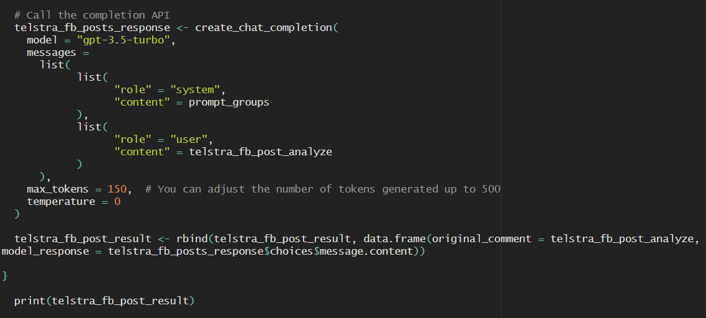
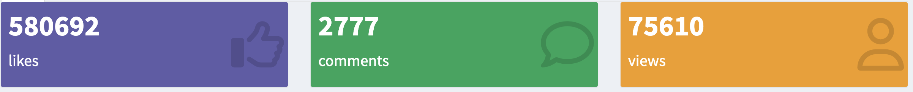
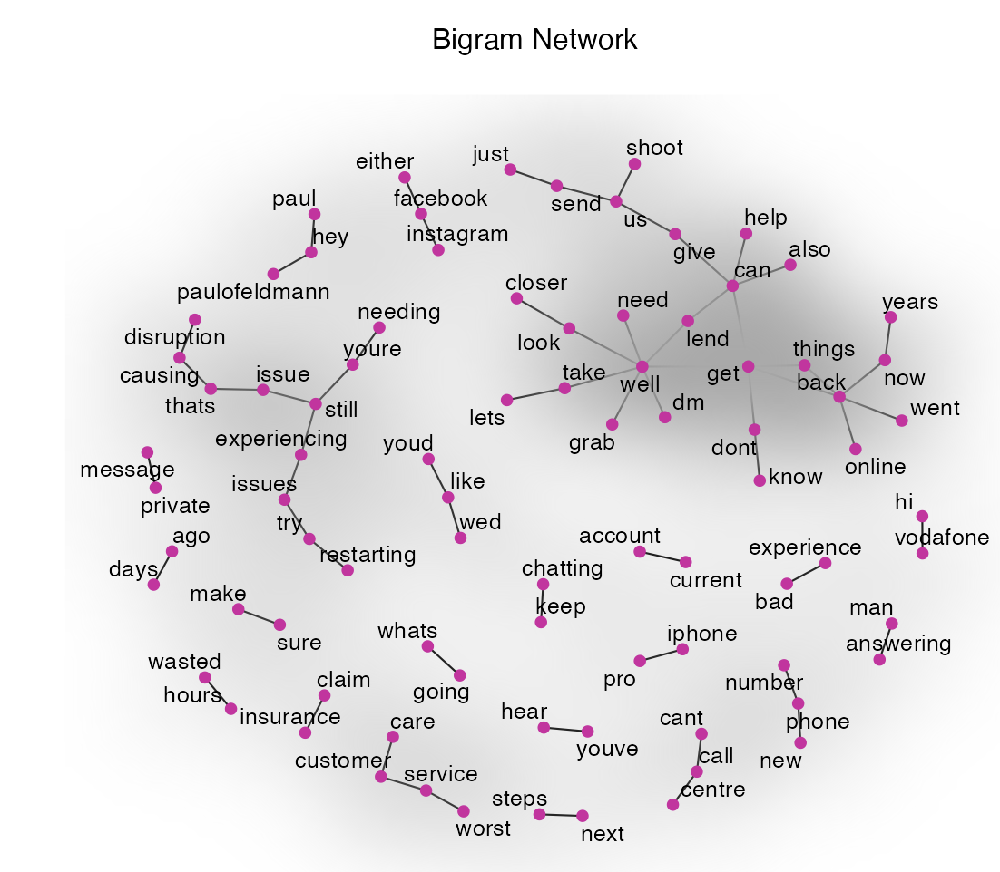
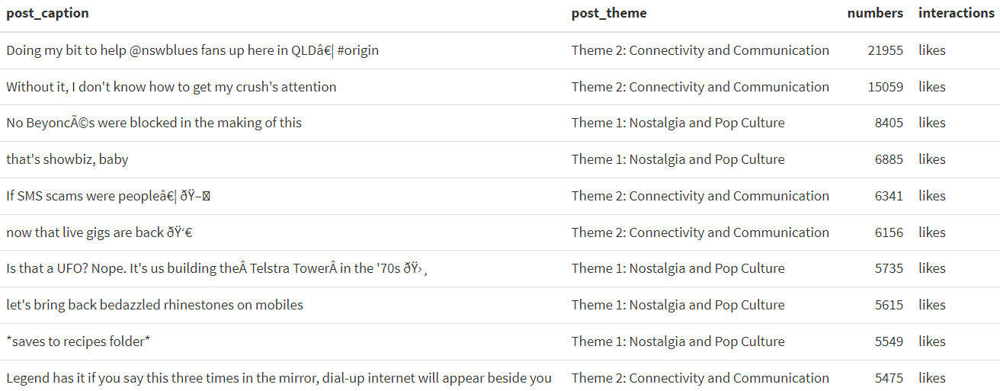
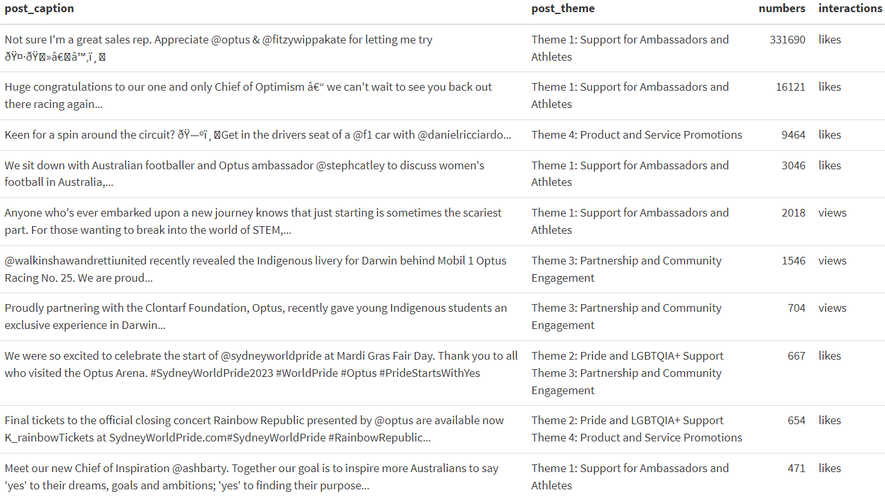
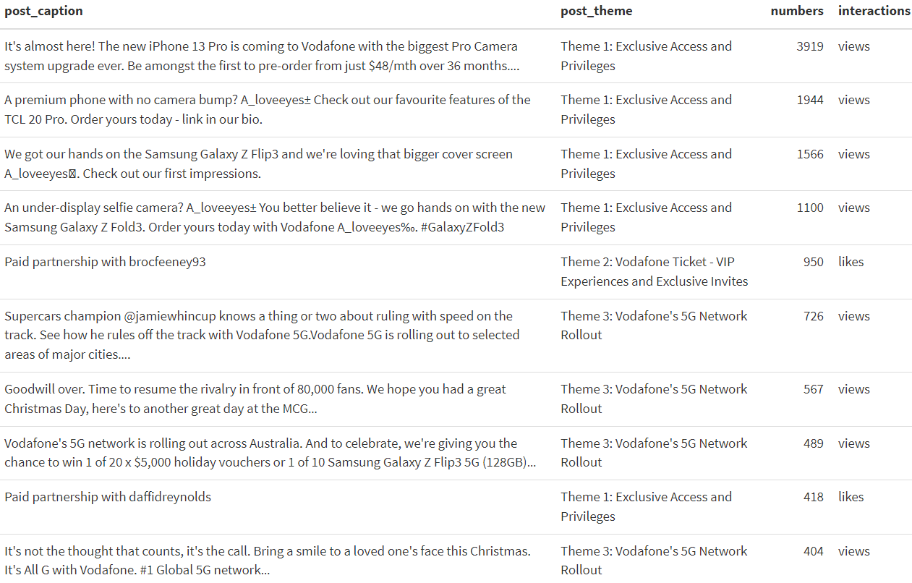
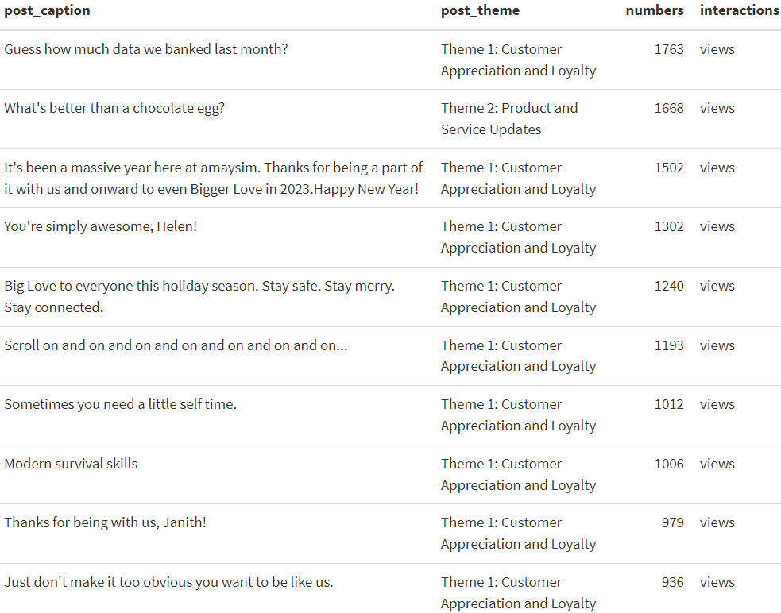
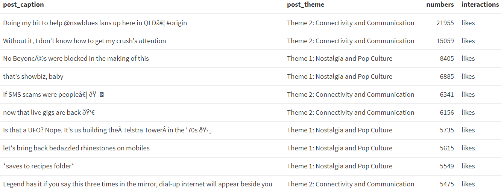
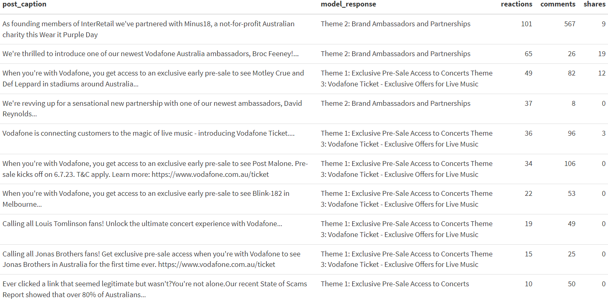
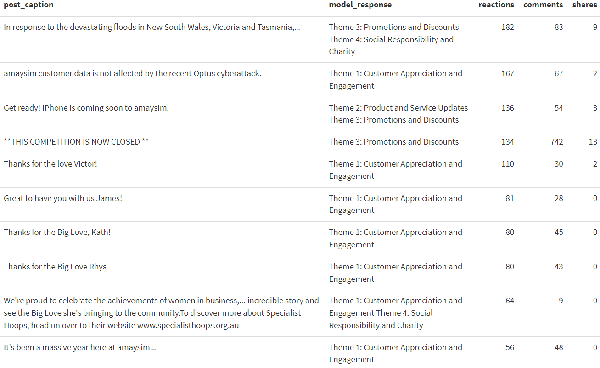

\newpage

```{r, echo = FALSE, message = FALSE, warning = FALSE}
library(tidyverse)
library(readr)
library(bookdown)
library(tinytex)
library(readxl)
library(kableExtra)
```


# Abstract

This report aims to analyze social media data, especially for Facebook and Instagram, based on popular telecommunication brands: Telstra, Optus, Vodafone and Amaysim. With the data had been pulled directly from mentioned social media platforms by the team at Forethought, from April 2021 to August 2023. With the main business objective of "Understand the brands within the social media culture".

The analysis involved methodologies from text-mining, sentiment analysis, word linkages, and OpenAI API Model. Each methodology is extensively explored to capture the essence of the data findings in corresponding to business and analytic objectives. The analysis mentioned progressively process through EDA and In-depth analysis from the bigger scope to narrow scope style.

Findings ranges from trends, networks, overall summary and deep-dive summary as analysis goes. Overall, each brand proved to have different posting style, based on their brand images. As well as, each brand is differ in terms of themes which driven their posts' content and style. All of which could be used to further analyze and recommend for the client of the brand health and image in the upcoming and potential future project at Forethought.

The access to this project GitHub is below.
GitHub repository link : https://github.com/Forethought-Monash-Internship-2023

Important Note 1: Package and documentation usage for this project lies within the internal repository which is set as private for usage only at Forethought.

Important Note 2: OpenAI and API Model is extensively used merely as sentiment and NLP analysis, not assisting in any writing nor compiling any report.

# Background and Motivation

Enabling online connections and communications between people globally would be an understatement for social media, as it has shaped both professional and personal lives with immense impacts beyond mere people interactions. It has been gradually yet significantly evolving individuals’ news consumption, media and entertainment, and especially product and service consumption behavior. In 2022, internet users aged between 16 to 64 years old spend approximately 2 hours and 30 minutes daily on social media, with an upward trajectory of 2 percent at the start of 2023 (Kemp, 2023). These facts encourage firms to discover relationships and engagements between firms/brands and consumers, which would greatly improve customer service, marketing decisions, product development, and various business decisions and activities. Besides, with approximately 4.9 billion people engaging in social media worldwide, the gigantic amount of digital footprints and data generated from these users are of utmost value for firms, brands, and various organizations (Wong, 2023). Consequently, firms across the globe then utilize this enormous data pool to connect all nodes and dots, rationalize trends and insights, and ultimately adjust their business decisions and strategies accordingly and suitably with ever-changing consumer consumption behavior.

Regardless of the vast opportunities that arise from data gathering from social media platforms, making sense of these seemingly unrelated data pools is another obstacle to achieving. Not to mention the nature of social media data is unstructured and disorganized, improper text-mining type data extraction sometimes could cause data to be fragmented or disarrayed. As anyone could provide a self-produced contribution to social media platforms – as comments, posts, and other reactions (Mutlu-Bayraktar, 2017), data is then being generated globally with difficulties considering various consumers’ demographic data. Subsequently, in social media where it is an open public space for any comments, thoughts, and criticism, consumer demographics and criteria are often arbitrary and unknown - creating even further mislinkage across and between datasets. Fortunately, as data scientists and researchers are getting familiar with the nature of social media data, they are effectively thriving to understand the “Big Data” of social media by utilizing quantitative algorithms to procedurally understand human thoughts, motives, and drivers for posting and commenting (Bishop, 2017). As a result, sophisticated and systematic analysis procedures are required to create linkage, produce appropriate analysis methods, and extract valuable and sensible insights and findings.  

Therefore, in this project, under an excellent opportunity to work and cooperate with the data scientist team at Forethought, the team could turn this seemingly challenging project into a manageable streamline with appropriate guidelines to tackle the complicated subject of social media analysis. Ultimately, this project substantially motivates the team to discover relationships between post-comments, themes, and drivers for the datasets related to social media. By taking advantage of not only available and well-regarded text-mining methodologies, but also professional and well-proved analysis techniques and procedures from the team at Forethought, it is exciting to share what has incubated our thoughts, learned valuable analytical knowledge, struggled through challenges in professional settings, and discovered the long-strived insights in this report.


# Business Objectives

At the beginning of this project, our team was assigned to conduct an exploratory data analysis on the datasets, which had been pulled from Facebook and Instagram – more specifically in the form of posts, comments, time stamps, and their reactions from the four popular telecommunication brands of Telstra, Optus, Vodafone and Amaysim (more information to be explained in the data section). That first milestone of ours was to explore the datasets and generate ideas of what could have been a proper business objective going forward. Thereafter, the broad ideas of trends, sentiments, and emotional stimulation within these datasets corresponding to social media consumers are generated. As a result, after a thorough and profound discussion with the data scientist team at Forethought, a solid business objective is created.

Business objective: “Understand the brands within the social media culture”. 

With that well-structured business objective laid as the foundation, it is a must to generate analysis goals and objectives that explore and discover what brands or Forethought’s potential client would want to see and improve their brandings. Ultimately, goals and objectives are set, which aligned with corresponding the business objective as follows:

Analysis Objectives:
-	Evaluate and analyze the effectiveness and efficiency of brand posts.
-	Develop models to enhance and optimize posts based on discovered themes and drivers.
-	Understand consumers’ engagement and audience reach through comments and reactions.

Furthermore, our working team was keen to provide us with guidance regarding methodologies and progressive planning. Consequently, the team mutually proposed methodologies of R Shiny – including trend analysis, text-mining, and sentiment analysis, and the OpenAI r package for qualitative exploration and analysis for themes, drivers, and motives. These two methodologies would be the backbones for this project going forward to tackle the complexity of datasets which are composed of both quantitative and qualitative nature sides. Subsequently, the following are the methodologies and their descriptions of usage which correspond to both analysis and business objectives.

Methodologies usage:
- Social media analysis on relationship of Facebook and Instagram data of post versus comments
- Social media trend, sentiment and performance analysis
- Text summarization and NLP with OpenAI large language model API

To elaborate further, quite essential work plans from the Forethought team are being introduced, including “sprint plan” and “retrospective”. Both of these have been conducted every fortnight, whereas the sprint plan focuses on the milestone the working team needs to achieve and how to get there, with retrospective focus on the four quadrants of ‘what was good’, ‘what needed improvement’, ‘ideas’ and ‘actions’ (see Figure \@ref(fig:workflow1) below). These workflow plans are key success indicators and paths for our project, as they will be numerously mentioned in the learning section again further in this report.

```{r workflow1, out.width = '100%', echo = FALSE, fig.align="center", fig.cap ="Sprint Plan and Retrospective", fig.pos = "H"}

```

Explaining further on the usage of sprint plan and retrospective workflow, the team utilize these frameworks to process and generate progressive goals ahead every fortnight. With this in mind, week 1-2 focuses on 'Project Inception and Market Analysis' - understanding overall work scope and project induction; week 3-4 focuses on 'Data wrangling and Preliminary Analysis' - extensively cleaning the data and starting basic analysis with EDA; week 5-6 focuses on 'Insights Analysis and Report Preparation' - concluding the result of insights with report initiation; week 7-8 focuses on 'Documentation and Report Finalization' - wrapping up the project with final report, chronologically and respectively. Thus, both frameworks provide the team excellent guidelines on where the project is heading with tangible goals ahead, alongside ability to realize what should be strengthen and where should be resolved.

Last but not least, the analysis of this project would greatly and mutually help the data science team at Forethought for further usage as a client presentation item for project briefs and proposals. These methodologies would help the team have a better understanding of further usage and different approaches of analysis perspective – assisting them in future projects. Hence, the contributions of this project would significantly help both students from Monash to perform and use their knowledge to draw analysis and insights in the real-world setting, while the data science team at Forethought could also make use of analysis, methodologies, and findings to further conduct future project with clients. 

# Data and Methodology

## Data Sources

The four datasets analyzed in this report comprise posts and comments pulled from Facebook and Instagram social media, regarding the four brands Amaysim, Optus, Telstra, and Vodafone. These data are from open-source origin with no disclosure or license issue and thus can be used both internally and externally in this project and others.

## Data Cleaning

### Preliminary cleaning:

In the data preparation phase, several vital functions are used. The `rep_str` function is used to set up a replacement text for Emojis. While the `str_replace_all` function is deployed to systematically replace Emoji texts in both the posts and comments datasets.

Additionally, the `gsub` function plays a crucial role in the substitution of spaces, commas, and other special characters within variables, ensuring data is tidy. For more targeted character adjustments, regular expressions are employed. The `separate` function is used for splitting a character column into two columns to meet specific requirements. Extracting specified strings is facilitated by the `str_extract` function.

Ensuring uniformity in date formats is a critical step. Both posts' publish dates and customers' comment dates are standardized using the `mdy` function. Furthermore, dates denoted as *two weeks ago*, *one day ago*, *three months ago*, and so on are harmonized into a standard date format using the `add_with_rollback` function.

### Deep cleaning (for the development of our R Shiny application):

Utilizing the `select` function to filter out brand names and post URLs from the posts dataset, which are then stored in a separate dataset labeled *FB/IG_url*. To ensure uniformity, brand names are standardized within the posts dataset. The `pivot_longer` function converts the data for customer actions, comments, and shares on Facebook, as well as likes, comments, and views on Instagram, into a long format. It is convenient to use the `facet_wrap` function to draw multi-panel time series plots about different customer reactions when making R shiny. This feature allows for a clear and organized presentation of data, making it easier for users to compare and analyze trends across different response metrics.

The comments dataset and *FB/IG_url* are in-joined using the `inner_join` function to match which brand each customer's comments belong to. Furthermore, a crucial aspect of the data preparation involved performing an inner join operation using the `inner_join` function between the comments dataset and the *FB/IG_url* dataset. This operation could establish clear associations between customer comments and their respective brands.

Acquiring a set of stop words utilizing the `get_stopwords` function, employing the snowball lexicon. These stopwords are stored in a dataset named *stopword*. Both posts and comments are separated into individual words or pairs of words using the `unnest_tokens` function. This step is essential for further analysis. The *stopword* dataset is reintegrated using a back-join operation with the `anti_join` function, effectively removing the identified stop words. The resulting dataset is stored for subsequent use in generating wordclouds, sentiment analysis plots, and other analytical outputs.

Introducing a new variable pertaining to brands within the themes of posts dataset with the `append` function. Merging the datasets pertaining to themes of posts from both Facebook and Instagram, using the `rbind` function to ensure a unified and comprehensive view of brand-related. Both posts and comments items are being extracted into single column vector as prepared for OpenAI analysis in further NLP qualitative analysis section.

## Data Limitations

- Limited historical data: Access to historical data through APIs poses a constraint on long-term trend analysis. For example, Facebook's Graph API typically allows access to data from the past 90 days. This limitation necessitates a focused approach to extracting and interpreting data within this time frame.

- Sample bias: It is crucial to recognize that the customer base actively engaging on social media platforms may not fully represent the broader population. This inherent bias can influence the insights derived from the data, prompting a cautious approach to generalizing findings.

- Sparse data: Data sparsity emerged as a significant consideration. Not all customers furnish comprehensive information, and not all posts contain pertinent data for analysis. This scarcity can impact the depth and scope of analytical endeavors.

- Data quality: An additional challenge arose from the diverse and sometimes unstructured nature of customer-generated content. Comments often encompassed a range of linguistic variations, including slang, potential spelling errors, and non-standard language. These intricacies presented hurdles for natural language processing tasks.

- Data loss and missing: As the data scientist working team pulled this data using Python and internal methods, some data appeared missing, especially when proceeding with the join function. Making some data unusable and un-comprehensive. Thus, the majority of data can be utilized for analysis, while the minority unfortunately has to be dropped.

## Data Dictionary

As mentioned earlier, these datasets comprise posts, comments, time stamps, and reactions from the four telecommunication brands Telstra, Optus, Vodafone, and Amaysim. They have been gathered at the start of the project, approximately in July, from April 2021, up to August 2023. While the original dataset pulled fresh from social media platform contain numerous variables, only the majority of them make sense for analysis purpose. Therefore, these are variables that would be included in both the data dictionary and analysis.

These datasets contain character, numeric, and date-type variables. The datasets reside within the *clean_data* folder, where they are separated by 'Facebook' and 'Instagram' datasets, with further three files for the post, comments, and combined post-and-comment. Since each data file category is different, data dictionaries are separated by their post-comments and Facebook-Instagram files data_dict.

```{r read_datadict, echo=FALSE, eval=TRUE}
data_dict_FB_post <- read_excel("data_dict/data_dict_FB_post.xlsx")
data_dict_FB_comment <- read_excel("data_dict/data_dict_FB_comment.xlsx")
data_dict_IG_post <- read_excel("data_dict/data_dict_IG_post.xlsx")
data_dict_IG_comment <- read_excel("data_dict/data_dict_IG_comment.xlsx")
```

```{r datadict_table1, echo=FALSE, eval=TRUE}
kable(data_dict_FB_post) %>% 
  kable_styling(latex_options = c("scale_down", "hold_position"))
```

```{r datadict_table2, echo=FALSE, eval=TRUE}
kable(data_dict_FB_comment) %>% 
  kable_styling(latex_options = c("scale_down", "hold_position"))
```

```{r datadict_table3, echo=FALSE, eval=TRUE}
kable(data_dict_IG_post) %>% 
  kable_styling(latex_options = c("scale_down", "hold_position"))
```

```{r datadict_table4, echo=FALSE, eval=TRUE}
kable(data_dict_IG_comment) %>% 
  kable_styling(latex_options = c("scale_down", "hold_position"))
```

## Methodologies

### Time series method

Employing a time series plot to illustrate the trend of customer reactions to brand posts over time on both Facebook and Instagram. Each brand is represented by a distinct color, offering a clear visual distinction. To further enhance visualization, use the `facet_wrap` function to create multiple panels. For Facebook, these panels encompass a combination of reactions, comments, and shares, while for Instagram, they comprise likes, comments, and views. This segmentation enables users to quickly discern the trends in customer engagement metrics over time. This approach provides an effective means to assess the popularity of each brand's posts across both platforms. The use of color coding and facet panels enhances the visual clarity, allowing for a detailed examination of customer reactions.

### Natural Language Processing (NLP) method

While gauging the 'heat' of each brand's posts is informative, it is essential to delve deeper into the insights that social media data offers. Unlike conventional surveys or questionnaires, individual expressions on social media are highly personalized. Therefore, employing advanced Natural Language Processing (NLP) techniques becomes instrumental in extracting nuanced insights. By harnessing NLP methods, such as word cloud mapping, sentiment analysis, and customer behavioral analysis, users can gain a more profound understanding of prevailing social media trends and brand performance. These techniques can dissect the language and sentiments expressed by customers, providing a comprehensive view of public opinions and attitudes. Incorporating NLP methodologies not only unveils hidden patterns but also allows us to capture sentiments that might elude traditional analysis approaches. This method, in turn, equips a more accurate and insightful assessment of social media trends and customer behavior.

### OpenAI Large Language Model API

In the realm of social media data analysis, using the power of the OpenAI Large Language Model API for textual summarization. API is a critical tool in extracting textual topics from the vast pool of social media content by filtering out extraneous and less relevant information and obtaining the most meaningful topics, providing users with a clear and concise overview for informed decision-making and strategic planning. In this project, "gpt-3.5-turbo" is used as our main model for the analysis majority of qualitative processes, for its excellent ability to detect, process, and extract with language at fast speed and reliable cost - especially optimized and capable of chat completion API. The function `create_chat_completion` is mainly used in "openai" package in r to employ OpenAI to process natural language detection and complete our request through various appropriate prompts, pertaining to themes, drivers, and analysis that would like to see. In the figure \@ref(fig:ai1) below are examples of OpenAI function usage and prompts. Themes are drivers are both generally explored in the holistic view, then after mutual themes and drivers are discovered, these themes and drivers output from openai will be categorized within each brand and post to find where each post lies within which themes, as seen in prompts in figures \@ref(fig:ai2) and \@ref(fig:ai3) below. These methodologies will be elaborated further in the findings section.

```{r ai1, out.width = '100%', echo = FALSE, fig.align="center", fig.cap ="OpenAI Prompt Example 1", fig.pos = "H"}

```

```{r ai2, out.width = '100%', echo = FALSE, fig.align="center", fig.cap ="OpenAI Prompt Example 2", fig.pos = "H"}

```

```{r ai3, out.width = '100%', echo = FALSE, fig.align="center", fig.cap ="OpenAI Prompt Example 3", fig.pos = "H"}

```


### R shiny for visulization

Using the R shiny app to display the visualization results. As shown in the Figure \@ref(fig:Plot1), it is the layout interface of the whole R shiny. The title is Social Media Analysis, which corresponds to the entire project. 

```{r Plot1, out.width = '100%', echo = FALSE, fig.align="center", fig.cap ="R shiny interface", fig.pos = "H"}
knitr::include_graphics("plots/plot1.png")
```

On the left side, under Menu Item, users find a combination of R Shiny's dropdown controls. The first control as shown \@ref(fig:Plot2) is the data source, which allows users to switch between Facebook and Instagram datasets dynamically. 

```{r Plot2, out.width = '40%', echo = FALSE, fig.align="center", fig.cap = "Data source control", fig.pos = "H"}
knitr::include_graphics("plots/plot2.png")
```

The second, Date Ranges as shown \@ref(fig:Plot3), provides a feature-rich control for precise time range filtering, ensuring analysis accuracy. 

```{r Plot3, out.width = '40%', echo = FALSE, fig.align="center", fig.cap = "Date ranges control", fig.pos = "H"}
knitr::include_graphics("plots/plot3.png")
```

The third control Brand as shown \@ref(fig:Plot4), allows users to explore specific telecom operators like Amaysim, Optus, Telstra, and Vodafone. To enhance usability, convenient *Select All* and *Clear All* options are provided for effortless brand selection management.

```{r Plot4, out.width = '40%', echo = FALSE, fig.align="center", fig.cap = "Brand control", fig.pos = "H"}

```


# Results and Fingdings

## Posts Findings

### Value boxes

Using the `valueBox` function within R Shiny to craft three visually engaging value boxes, spotlighting key summary statistics related to customer responses over time. The three value boxes provide real-time insights into the evolving metrics: the count of reactions, comments, and shares on Facebook \@ref(fig:Plot5) or the aggregate sum of likes, comments, and views on Instagram \@ref(fig:Plot6), all contextualized within the current filtering parameters. Notably, the data underscores that posts on Instagram generate a notably higher level of customer interactions compared to Facebook.

```{r Plot5, out.width = '80%', echo = FALSE, fig.align="center", fig.cap = "Facebook value boxes", fig.pos = "H"}

```

```{r Plot6, out.width = '80%', echo = FALSE, fig.align="center", fig.cap = "Instagram value boxes", fig.pos = "H"}

```

Furthermore, an in-depth analysis reveals that posts affiliated with the Telstra \@ref(fig:Plot7) brand exhibit a remarkable surge in engagement, surpassing that of the other three brands. This insight emphasizes Telstra's notable influence and resonance within social media.

```{r Plot7, out.width = '80%', echo = FALSE, fig.align="center", fig.cap = "Facebook value boxes of Telstra", fig.pos = "H"}
knitr::include_graphics("plots/plot7.png")
```

### Time series plot

Time-series plots \@ref(fig:Plot8) are pivotal in providing a visual narrative of key customer engagement metrics within the data. They offer a clear avenue to monitor the ebb and flow of customer interactions, discern brands exhibiting notable engagement, pinpoint specific times and dates of heightened activity, and ultimately gauge the popularity and influence of social media content.

```{r Plot8, out.width = '100%', echo = FALSE, fig.align="center", fig.cap = "Time series plot", fig.pos = "H"}

```

For instance, delving into the Facebook dataset, a standout observation was Telstra's post \@ref(fig:Plot9) on February 3, 2023. This post garnered an exceptionally high number of customer reactions and shares. The post, humorously captioned *POV every dads belt in 1999*, cleverly references a specific period (1999) and taps into a universally relatable parenting experience. By addressing a potentially severe topic like discipline in a light-hearted manner, the post strikes a chord with individuals who came of age during that era. This clever use of nostalgia triggers a wave of strong emotions and memories, making customers engage actively with the post. This analysis underscores the potent impact that well-crafted content can wield, resonating deeply with audiences and fostering heightened engagement levels.

```{r Plot9, out.width = '40%', echo = FALSE, fig.align="center", fig.cap = "Time series plot of Telstra", fig.pos = "H"}

```

In the time series plot \@ref(fig:Plot10) of the Instagram dataset, a vast gap arises in the likes number. This post, jointly published by Optus and the renowned Australian racing driver Daniel Ricciardo, garnered an astounding 330,000 likes. The involvement of a highly influential celebrity like Ricciardo significantly amplifies the post's visibility and impact. This observation underscores a strategic avenue for brands - collaborating with well-known personalities. Such partnerships enable brands to harness the extensive reach and influence of celebrities, expanding their follower base and extending their brand's outreach. This symbiotic relationship not only enhances brand visibility but also fosters a broader and more engaged audience. 

```{r Plot10, out.width = '40%', echo = FALSE, fig.align="center", fig.cap = "Time series plot of Optus", fig.pos = "H"}

```

### Wordcloud plot

The word cloud shows the top 60 words with the highest word frequency in the post text for the current filter. Words that occur more frequently are visually emphasized with larger font sizes in the word cloud map. In the Facebook dataset  \@ref(fig:Plot11), the word *amaysim* emerges with the highest frequency, tallying 31 occurrences. Other commonly used words include *big*, *caption*, and *event*. Meanwhile, within the Instagram dataset \@ref(fig:Plot12), *optus* takes the lead with a frequency count of 70 instances. Additional prevalent terms encompass *big*, *love*, *amaysim*, and more. These frequently occurring words exemplify common themes prevalent in social media content. They serve as critical indicators of the prevalent topics and discussions within the realm of social media data.

```{r Plot11, out.width = '50%', echo = FALSE, fig.align="center", fig.cap = "Word cloud of Facebook posts", fig.pos = "H"}
knitr::include_graphics("plots/plot11.png")
```

```{r Plot12, out.width = '60%', echo = FALSE, fig.align="center", fig.cap = "Word cloud of Instagram posts", fig.pos = "H"}
knitr::include_graphics("plots/plot12.png")
```

### Net sentiment plot

The net sentiment plot \@ref(fig:Plot13) serves as a visual representation of different brand posts over time about the balance between positive and negative sentiments. A positive value on the y-axis indicates that posts published by the brand within a given month exhibit an overall positive sentiment. In contrast, a negative value signifies a prevailing negative sentiment. Notably, a majority of posts across both Facebook and Instagram social media platforms manifest an overall positive sentiment. It is imperative to highlight a trend observed in the Facebook dataset. Telstra's posts experienced six months with a net negative overall sentiment. Overall, the net sentiment plot underscores a clear correlation between positive sentiment and heightened engagement rates. Customers exhibit a greater propensity to share content that evokes positive emotions, underscoring the pivotal role of sentiment in fostering customer interactions.

```{r Plot13, out.width = '70%', echo = FALSE, fig.align="center", fig.cap = "Net sentiment plot", fig.pos = "H"}
knitr::include_graphics("plots/plot13.png")
```

### Different themes plot

The Column plot, combines with the `facet_wrap` function for multi-panel display, presents a clear visual representation of the number of topics associated with different branded posts. This feature aids users in swiftly discerning and categorizing pertinent topics related to branded content across social media platforms. When correlated with the earlier time series plot, this visualization offers an additional layer of insight, shedding light on which types of topics wield the most resonance with customers. This valuable information empowers brands to adjust their marketing strategies, ensuring they remain attuned to evolving consumer interests and preferences.

In the Facebook \@ref(fig:Plot14) and Instagram \@ref(fig:Plot15) datasets, a distinct trend emerges: Amaysim predominantly centers its posts around themes of customer appreciation, engagement, and loyalty. This strategic focus indicates an effort by Amaysim to bolster customer satisfaction and fortify brand loyalty. The consistent expression of gratitude towards customers and positive interaction further strengthens these crucial relationships. This approach has profound implications for customer retention. Over time, individuals who experience higher levels of satisfaction and a sense of loyalty are markedly more inclined to continue availing of Amaysim's services. Their reduced likelihood of exploring offerings from competing brands underscores the enduring impact of Amaysim's customer-centric approach.

```{r Plot14, out.width = '100%', echo = FALSE, fig.align="center", fig.cap = "Themes plot from Facebook dataset", fig.pos = "H"}
knitr::include_graphics("plots/plot14.png")
```

```{r Plot15, out.width = '100%', echo = FALSE, fig.align="center", fig.cap = "Themes plot from Instagram dataset", fig.pos = "H"}
knitr::include_graphics("plots/plot15.png")
```

Optus and Telstra, in contrast, their posts predominantly focus on topics related to product and service promotions as well as updates. This strategic emphasis equips them to maintain a competitive edge in the market. By leveraging social media platforms, they keep customers well-informed about the latest product features and enhancements. This proactive approach drives sales and encourages customers to embrace new offerings readily. The deployment of promotional and update-centric posts further enables these brands to vividly showcase the value and benefits inherent in their products and services. This approach not only solidifies their existing customer base but also serves as a potent attractor for new customers.

## Comments Findings

### Bigram network

The bigram network \@ref(fig:Plot16) visualization method unveils the interrelationship between consecutive word pairs within customer comments. The intensity of gray shading surrounding more frequently occurring word pairs provides a visual cue. This technique is a powerful tool for extracting insights into co-occurring terminologies, illuminating specific language patterns and expressions commonly employed in customer comments. Bigram can highlight key phrases or expressions that are frequently mentioned in customer comments, which helps to identify recurring themes. The resultant bigram network plot serves as a window into specific sentiments and feedback associated with a product, service, or overall experience. This dive into customer behavior and preferences equips brands with a heightened comprehension of their audience. Remarkably, each brand's bigram network prominently centers on pivotal terms like *customer*, *phone*, and *service*, among others. This focal point underscores that customers frequently invoke brand-associated products and services in their comments, affirming their relevance and resonance in customer discourse.

```{r Plot16, out.width = '55%', echo = FALSE, fig.align="center", fig.cap = "Bigram network from Facebook dataset", fig.pos = "H"}

```

Furthermore, a specific examination of the bigram network \@ref(fig:Plot17) for the Amaysim brand underscores a predominant focus on the term 'Amaysim'. 

```{r Plot17, out.width = '55%', echo = FALSE, fig.align="center", fig.cap = "Bigram network of Amaysim", fig.pos = "H"}

```

Within the Optus brand's bigram network \@ref(fig:Plot18), salient terms like *private* and *disappointing* emerge as central elements. This insight strongly suggests that customers frequently invoke the brand in their comments. Notably, the recurrent mention of *disappointing* in conjunction with *privacy* signals a noteworthy concern in customer feedback, warranting heightened attention from Optus in safeguarding customer information. 

```{r Plot18, out.width = '55%', echo = FALSE, fig.align="center", fig.cap = "Bigram network of Optus", fig.pos = "H"}
knitr::include_graphics("plots/plot18.png")
```

Additionally, the bigram network \@ref(fig:Plot19) for Vodafone AU pinpoints notable attention on terms like *check*, *issue*, and *disruption*, indicating a potential area of improvement in signal quality for their future products. This bigram network is a valuable suggestion for Vodafone AU to enhance signal performance in forthcoming offerings, further bolstering customer satisfaction.

```{r Plot19, out.width = '55%', echo = FALSE, fig.align="center", fig.cap = "Bigram network of Vodafone AU", fig.pos = "H"}

```

### Word cloud

The figure \@ref(fig:Plot20) is another type of word cloud map that offers a unique perspective, showcasing words that recur with higher frequency in customer comments. This word cloud map offers a unique perspective, showcasing words that recur with higher frequency in customer comments. It is a potent visual representation of customer sentiment, providing brands with an intuitive means to discern and comprehend customer feedback about their products and services. Notably, negative sentiment is depicted in red, concentrated in the upper half of the word cloud, exemplified by terms like *issue*, *scam*, and *problem*. Conversely, positive sentiment is portrayed in green, predominantly occupying the lower half, encompassing terms such as *like*, *happy*, and *good*. 

```{r Plot20, out.width = '60%', echo = FALSE, fig.align="center", fig.cap = "Word cloud of Facebook comments", fig.pos = "H"}
knitr::include_graphics("plots/plot20.png")
```

For specific campaigns or products, delving deeper into the emotions they evoke can yield invaluable insights, allowing brands to cater to customer preferences and needs more effectively. This type of word cloud proves particularly invaluable in crises, providing brands with the ability to swiftly identify trends or issues that may be contributing to negative sentiment among customers. With this word cloud, brands can proactively implement improvements based on customer feedback, ultimately elevating their overall ratings and bolstering customer satisfaction.

### Donut plot

This donut plot \@ref(fig:Plot21) is a visual tool for categorizing emotion words into distinct categories (such as positive, negative, angry, and so on). The visualization vividly showcases the distribution of these emotion categories as a percentage of total words in customer comments. This granular understanding of customer sentiment equips brands with a valuable metric to gauge customer satisfaction levels, thereby informing critical business decisions related to product enhancement, service optimization, customer experience refinement, and more. Upon analysis, it emerges that over 20% of the words in customer comments convey positive attitudes, underscoring a prevailing sense of contentment. Notably, words signifying anticipation, trust, and negative sentiment all constitute roughly 15% each. 

```{r Plot21, out.width = '40%', echo = FALSE, fig.align="center", fig.cap = "Donut plot of Facebook dataset", fig.pos = "H"}
knitr::include_graphics("plots/plot21.png")
```

It is intriguing to note that Vodafone AU's customer comments \@ref(fig:Plot22) exhibit a slightly lower percentage of words expressing positive emotions compared to the other three brands, warranting further exploration.

```{r Plot22, out.width = '45%', echo = FALSE, fig.align="center", fig.cap = "Donut plot of Vodafone AU", fig.pos = "H"}
knitr::include_graphics("plots/plot22.png")
```

### Tf-idf table

This table \@ref(fig:Table1) presents vital information on term frequency (tf), inverse document frequency (idf), and their combination, tf-idf. Term frequency (tf) quantifies the frequency of a word's occurrence within a customer's comment. On the other hand, inverse document frequency (idf) assesses the word's prevalence across all comments, discerning whether it is a common or rare term in the corpus. The concept of tf-idf lies in its ability to spotlight pivotal words within the comment content, achieving this by diminishing the weight of commonplace words while elevating the significance of less frequently used terms across the entire comment collection or corpus. A higher tf-idf value signifies the heightened importance of a word in the context of the comments.

```{r Table1, out.width = '70%', echo = FALSE, fig.align="center", fig.cap = "Tf-idf table of Facebook dataset", fig.pos = "H"}
knitr::include_graphics("plots/plot23.png")
```

In the current filter, the analysis highlights several keywords that carry significant weight across all customer comments. Notably, terms like *sorry*, *keen*, *win*, and *compatible* emerge as focal points. Intriguingly, the term *scam* also registers as a noteworthy factor as shown \@ref(fig:Table2). To delve deeper into this observation, the `grepl` function was employed to conduct a targeted search within customer comments. This research result unveiled a cluster of comments where customers expressed dissatisfaction with the branded data roaming service, citing arbitrary charges as a point of contention. Customers perceive this practice as deceptive, an aspect that warrants immediate attention and resolution.

```{r Table2, out.width = '70%', echo = FALSE, fig.align="center", fig.cap = "Tf-idf table of Instagram dataset", fig.pos = "H"}
knitr::include_graphics("plots/plot24.png")
```

Additionally, there were instances of customers reporting information leakage concerns with calling cards, along with an influx of fraudulent text messages and calls. To proactively address this issue, the staff is taking commendable steps by providing a designated website for reporting scam SMS/calls, thereby empowering consumers to take action against potential scammers. This analysis underscores the imperative for the brand to redouble efforts in curbing all forms of scams and spam, thereby further elevating consumer satisfaction and trust.


## Qualitative Findings using NLP

### Themes

Referring back to 5.1.5, where themes are shown in Figure \@ref(fig:Plot14) and Figure \@ref(fig:Plot15), each brand has its own set of themes that correspond to their posting style. These can be explored and analyzed further by understanding which themes brands would like to steer to. For example, Telstra focuses more on Product and Service updates and Technical Issues Resolution; while Optus focuses more on Promotions and Offers with a large amount of Sports Sponsorship and Events. These can help to see where brands want to be and how they would like to engage with their customers through these themes. Our prompt suggests to the API model to classify posts’ context based on relevancy for each theme from 0 to 100. Therefore, some post might have multiple relevance to the theme, which needs to be subjectively analyze based on context. 

Thereafter, these themes can be explored further on the performance of each brand's themes in relationship with reactions, such as, in this case likes and reactions number order in a descending fashion. For example from Instagram, in Figure \@ref(fig:theme1) and Figure \@ref(fig:theme2) tables are top posts by number of likes from Telstra and Optus, respectively. For Telstra, Theme 2: Connectivity and Communication and Theme 1: Nostalgia and Pop Culture dominate as most likes’ interaction for Telstra. However, Optus has more diversity in terms of post style which generates top rank liked post. Still, their best posts are related to Theme of Support for Ambassadors and Athletes and Theme of Product and Service Promotions. VodafoneAU and Amaysim also diverse in themes as seen in table Figure \@ref(fig:theme3), while Amaysim focuses merely in Customer Appreciation Theme as seen in table Figure \@ref(fig:theme4). Moreover, based on different objective, either likes, views, shares and comments number can be ordered accordingly as well.

```{r theme1, out.width = '100%', echo = FALSE, fig.align="center", fig.cap = "Telstra Instagram Themes", fig.pos = "H"}

```

```{r theme2, out.width = '100%', echo = FALSE, fig.align="center", fig.cap = "Optus Instagram Themes", fig.pos = "H"}

```

```{r theme3, out.width = '100%', echo = FALSE, fig.align="center", fig.cap = "Vodafone Instagram Themes", fig.pos = "H"}

```

```{r theme4, out.width = '90%', echo = FALSE, fig.align="center", fig.cap = "Amaysim Instagram Themes", fig.pos = "H"}

```

As for Facebook, the following figure of \@ref(fig:theme5), \@ref(fig:theme6), \@ref(fig:theme7); Telstra, VodafoneAU and Amaysim, respectively, can be explored as well. (Please note that, in this case, Optus top posts are all incorrectly pull from Facebook platform, making these top posts named as "No Caption", thus not included in this section). Similar conclusion can be drawn that Telstra is quite persistent with what's work in majority of their first and second themes. Whereas both Vodafone and Amaysim are in stage of exploration into different themes to find optimum ones.

```{r theme5, out.width = '100%', echo = FALSE, fig.align="center", fig.cap = "Telstra Facebook Themes", fig.pos = "H"}

```

```{r theme6, out.width = '100%', echo = FALSE, fig.align="center", fig.cap = "Vodafone Facebook Themes", fig.pos = "H"}

```

```{r theme7, out.width = '100%', echo = FALSE, fig.align="center", fig.cap = "Amaysim Facebook Themes", fig.pos = "H"}

```


### Drivers

Drivers refer to mutual themes of context for consumer comments, where their motives of writing or commenting are driven by certain motive, or driver in this case. Overall sentiment and a detailed sense of drivers on the holistic view of comments across each brand can be concluded and analyzed. Pre-set drivers of cost of plans, service, network, performance, and general expression could be used for API model to analyze. Also, further use API model to analyze comments based on mentioned drivers and explore the ratio of each brand's consumer drivers toward the overall post as well.

## Learning and Obstacles Discussion

### Learning Outcomes

**Real-World Objective-based Data Analysis Skills**

Since the majority of the courses taken throughout the Business Analytics major have to tackle numerical and statistical data, this project, on the contrary, has shaped our learning curve and thoughts toward more marketing analytic side. This helps us understand and create linkage quantitatively and qualitatively throughout the work streamlining from EDA to insights analysis. Furthermore, critical thinking skills are greatly developed when it comes to data analysis; this is helpful for us that must be realize and focus on what insights and results our stakeholders would like to see, making our thought process more comprehensive to develop appropriate analytical methodologies and tools to help achieve results which align with business objective. 

**Professional Settings Working Team**

Besides our analytical skills which have been enhanced, our teamwork ability in this field has also been honed. Understanding how much teamwork skills is valuable in the professional setting, especially with supervisors and colleagues. Connecting and keeping in touch across the team to reach mutual goals greatly help us understand and improve our ability to work analytically with others. Also, with the great help of the sprint plan and retrospective meeting, the team has gradually improved analytical learning skills by understanding their weaknesses and strengths alongside actions and ideas planning. By combining all those items together, the team can shape their working style coherently towards the mutual goals of every milestone and ensure the on-track stage of every member.

**Prompt Engineering**

Quite an interesting topic that the team has learned in this project. The usage of OpenAI itself would be ineffective without proper prompt input into the completion request. Properly creating meaningful and efficient prompts for each task, analysis, and consolidation of data is proven to be crucial. Given that this field of prompt engineering has become more popular over the years, this skill would excellently help us make use of OpenAI more profound and useful. As a result, writing a descriptive and detailed, yet concise and compact prompt while ensuring that not request multiple tasks for OpenAI is the best type of prompt that we could use to extract our findings.

### Obstacles Overcome

**Text-mining data cleaning**

The Data sets are overwhelming and obstruct our progress at the first stage, for their massive observations that seem unrelatable at first. However, the Forethought team significantly assisted in guiding through the EDA process, making the team understand what should be included, cleaned, and presented for the preliminary and deep analysis stage. Unlike pre-clean data that students have received during their courses, rearranging and cleaning untidy data in the business real-world setting takes more than delicate skills, but also an objective-based mindset to construct a proper thought process when cleaning the data.

**Displaying in R Shiny**

Since plenty of data visualizations are present to be shown, not every single one of them can be selected. Therefore, cohesively telling the story through R Shiny is another challenge. Digesting and compiling through the looking-glass of client and stakeholder, data visuals are crafty and presented with the story and cohesion in mind; ensuring that most of the visuals in R Shiny are compelling and interesting with story linkage in between each panel for client to explore.

**OpenAI Package**

As this package is mainly created with Python in mind and is relatively new, fine-tuning codes, commands, functions, and prompts using R is quite difficult. Several weeks have been spent on fine-tuning these openai package functions, especially prompt engineering which needs an extra number of trials and errors to find the best combination for different objectives. Nevertheless, with the help of the team at Forethought and internal learning, the OpenAI package has been thoroughly learned and explored for the best usage of this project.

# Conclusion

## Result highlighting

Upon an in-depth exploration and analysis of four distinct social media datasets, a comprehensive narrative has emerged, shedding light on the dynamic relationship between branded posts and customer comments within the realm of Australian telecom operators.

The time-series plot unequivocally illustrates the profound impact of innovative and emotionally resonant content, as well as collaborating with influencers to co-publish posts, in driving heightened customer engagement rates and amplifying brand visibility. Given that the level of customer interaction is higher for posts published on Instagram. Therefore, for brands seeking to maximize brand exposure, entirely allocating resources to create engaging post content on the Instagram social platform is a strategic task for brands.

Regarding sentiment and thematic analysis, it becomes evident that brands must maintain a vigilant watch on sentiment trends during content dissemination. Cultivating positive emotions within content not only bolsters customer engagement but also cultivates a more favorable brand perception. For telecom operators, striking a balance between customer-centric content and product/service updates emerges as a pivotal strategy. Focusing on customer appreciation, engagement, and loyalty fortifies satisfaction and retention while concurrently spotlighting product and service offerings ensures competitiveness within the market landscape.

In response to the data stories generated from customer comments, brands can make some appropriate adjustments in terms of services, products, and technological offerings. The common concerns of customers, such as data roaming charges, information security, and fraudulent calls/texts, should be of concern to brands. By actively mitigating these pain points, brands can effectively elevate customer satisfaction and foster brand loyalty. Notably, for Vodafone AU, which registers a comparatively lower percentage of positive sentiment in customer comments, considering improving the signal quality of the product is a step that should be addressed in increasing customer positivity and satisfaction.

Lastly, brands can explore their themes and drivers which contribute to their most liked and commented post. They could adjust accordingly while continuously keeping tap on their brand health via themes that they are trying to build while observing the evolution of drivers that would want to receive. Having this observation, Forethought could offer client with brand assistance and brand performance measurement on the monthly or quarterly basis.

## Limitation
Firstly, the data pulled from social media platforms are from specific time frame of two years, especially when API model is used to analyze, the amount of data trained and explored all counted toward the result. Meaning that should the time frame of the data has changed or more data is used into analysis, the result might be slightly altered. Therefore, progressively analyze the themes and drivers would keeping up with the brands upcoming and future trends

Secondly, the current model of API model used is "gpt-3.5-turbo". Therefore, if different model is used or newer model could apply better NLP understanding to the dataset, result could be altered for better as well.

Thirdly, As for drivers, since the complexity of drivers differ largely in both within the post itself and for the overall brand, drivers in this case are not match and would be extremely challenging to explore each post's drivers from consumer comments. Therefore, the general idea for drivers is provided for further exploration. 

Additionally, some type of post are unable to be pulled correctly from the social media platform, hence, not all the post may be used into this analysis report, for data integrity reasons.

Lastly, analysis on the qualitative insights are still largely subjective but professionally analyzed. Fine-tuning context of both post and comment needs judgement from the team, allowing only API model to handle would cause multiple mistakes along the way. Hence, please kindly note that different working team or stakeholder make take the analysis differently.

## Future Usage
As mentioned in Limitation and Result Highlights, this report provide a foundation for both client and agency side to identify where the brands are at and where or which way they can improve and steer towards. Since the data is only updated up to August 2023, new posts from then would already have appeared extensively. Hence, this report would serve as a framework for upcoming projects which require similar analysis methods, as well as pass brand health and image check.

# References

Bishop, J. (2017). Devising Parametric User Models for Processing and Analysing Social Media Data to Influence User Behaviour: Using Quantitative and Qualitative Analysis of Social Media Data. *In S. Hai-Jew (Ed.), Social Media Data Extraction and Content Analysis (pp. 1-41)*. IGI Global. https://doi.org/10.4018/978-1-5225-0648-5.ch001

Kemp, S. (2023, January 28). Digital 2023 deep-dive: How much time do we spend on social media? DataReportal – Global Digital Insights. https://datareportal.com/reports/digital-2023-deep-dive-time-spent-on-social-media

Mutlu-Bayraktar, D. (2017). Usability Evaluation of Social Media Web Sites and Applications via Eye-Tracking Method. *In S. Hai-Jew (Ed.), Social Media Data Extraction and Content Analysis (pp. 85-112)*. IGI Global. https://doi.org/10.4018/978-1-5225-0648-5.ch004

OpenAI. (2023). OpenAI API (gpt-3.5-turbo) [Large language model] http://openai.com/

Wong, B. (2023, August 7). Top social media statistics and trends of 2023. *Forbes Advisor.* https://www.forbes.com/advisor/business/social-media-statistics/


